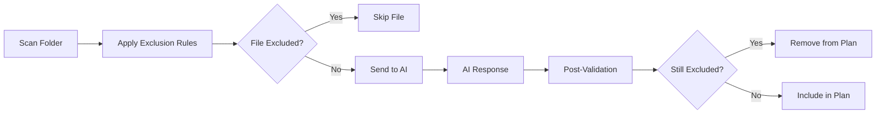

Exclusion Rules prevent specific files or folders from being moved during organization. Use rules to protect configuration files, system folders, or any content you want to keep in place.

## Overview

Exclusion rules are evaluated **before** AI processing:

- Files matching any enabled rule are excluded from the organization plan
- Rules can be based on name, path, size, date, or file type
- Built-in presets provide sensible defaults for common scenarios
- Custom rules offer unlimited flexibility

<Note>
  Exclusion rules are **deterministic** and bypass AI decision-making. If a file matches a rule, it will never be moved, regardless of AI suggestions.
</Note>

---

## Rule Types

Sorty supports 12 types of exclusion rules:

### File Extension

Match files by their extension.

<CodeGroup>
```yaml Examples
Pattern: pdf
  → Excludes: report.pdf, invoice.pdf

Pattern: jpg,png,gif
  → Excludes: photo.jpg, icon.png, animation.gif
```
</CodeGroup>

**Use case**: Protect all PDFs, configuration files (`.env`, `.config`), or specific file types.

### File Name

Match files containing specific text in their name.

<CodeGroup>
```yaml Examples
Pattern: README
  → Excludes: README.md, README.txt, README_old.md

Pattern: config
  → Excludes: config.json, app.config, config_backup.yml
```
</CodeGroup>

**Options**:
- **Case Sensitive**: Match exact case only
- **Negated**: Exclude files that DON'T contain the pattern

### Folder Name

Exclude entire folders by name.

<CodeGroup>
```yaml Examples
Pattern: node_modules
  → Excludes: Any folder named "node_modules" at any depth

Pattern: .git
  → Excludes: Git repositories
```
</CodeGroup>

<Warning>
  Folder name rules exclude the entire folder and all its contents. Use cautiously.
</Warning>

### Path Contains

Match files whose full path includes specific text.

<CodeGroup>
```yaml Examples
Pattern: /Archive/
  → Excludes: /Users/me/Documents/Archive/old_file.pdf

Pattern: Important
  → Excludes: /Projects/Important_Stuff/doc.txt
```
</CodeGroup>

**Use case**: Protect files in specific subdirectories or with path-based naming conventions.

### Regular Expression (Regex)

Advanced pattern matching using regular expressions.

<CodeGroup>
```regex Examples
# Match version numbers
Pattern: v\d+\.\d+\.\d+
  → Excludes: app_v1.2.3.zip, release_v2.0.1.dmg

# Match temporary files
Pattern: ^\.(temp|tmp|cache)
  → Excludes: .temp_file, .tmp_data, .cache_dir

# Match date prefixes
Pattern: ^\d{4}-\d{2}-\d{2}
  → Excludes: 2024-03-15_report.pdf
```
</CodeGroup>

<Tip>
  Use [regex101.com](https://regex101.com) to test and debug regular expressions before adding them to Sorty.
</Tip>

### File Size

Exclude files based on size (in megabytes).

<CodeGroup>
```yaml Examples
# Exclude large video files
Larger than 500 MB
  → Excludes: movie.mp4 (2.1 GB), project.zip (800 MB)

# Exclude tiny files
Smaller than 1 KB
  → Excludes: .DS_Store (6 bytes), Thumbs.db (0.5 KB)
```
</CodeGroup>

**Use case**: Skip very large files (videos, disk images) or tiny system files.

### Creation Date

Exclude files based on when they were created.

<CodeGroup>
```yaml Examples
# Exclude old files
Older than 365 days
  → Excludes: Files created over a year ago

# Exclude recent files
Newer than 7 days
  → Excludes: Files created in the last week
```
</CodeGroup>

**Use case**: Organize only recent files, or protect archived content from being moved.

### Modification Date

Exclude files based on last modification date.

<CodeGroup>
```yaml Examples
# Skip recently modified files
Newer than 1 day
  → Excludes: Active working files

# Skip stale files
Older than 180 days
  → Excludes: Files untouched for 6+ months
```
</CodeGroup>

### Hidden Files

Automatically match files starting with `.` (dot files).

<CodeGroup>
```bash Examples
Excludes:
  .DS_Store
  .gitignore
  .env
  .config
```
</CodeGroup>

<Note>
  This rule requires no pattern—it's enabled/disabled with a toggle.
</Note>

### System Files

Match macOS and Windows system files.

<CodeGroup>
```bash Built-in System File List
.DS_Store
Thumbs.db
desktop.ini
.Spotlight-V100
.Trashes
.fseventsd
.TemporaryItems
```
</CodeGroup>

### File Type Category

Match files by high-level category.

| Category | Included Extensions |
|----------|--------------------|
| **Images** | jpg, png, gif, heic, webp, svg, raw, psd, ai |
| **Videos** | mp4, mov, avi, mkv, wmv, flv, webm, m4v |
| **Audio** | mp3, wav, aac, flac, ogg, m4a, aiff, midi |
| **Documents** | pdf, doc, docx, txt, rtf, pages, md, epub |
| **Archives** | zip, rar, 7z, tar, gz, dmg, iso, pkg |
| **Code** | swift, py, js, ts, html, css, java, rb, go, rs |
| **Applications** | app, exe, msi, apk, ipa |
| **Fonts** | ttf, otf, woff, woff2 |
| **Databases** | db, sqlite, sqlite3, mdb, realm |

**Use case**: Exclude all images, all code files, or all documents with a single rule.

### Custom Script

Run AppleScript to determine if a file should be excluded. This allows programmatic exclusion logic based on file metadata, content, or system state.

<CodeGroup>
```applescript Example
-- Exclude files larger than 100MB
tell application "Finder"
  set fileSize to size of (POSIX file theFile)
  if fileSize > 104857600 then
    return true
  else
    return false
  end if
end tell
```
</CodeGroup>

**Use case**: Advanced filtering based on custom logic, integration with other apps, or complex metadata checks.

---

## Creating Rules

<Steps>
  <Step title="Open Exclusions">
    Navigate to **Exclusions** in the sidebar (or press `⌘4`).
  </Step>
  <Step title="Add Rule">
    Click **Add Rule** button in the top-right.
  </Step>
  <Step title="Select Type">
    Choose a rule type from the dropdown (e.g., File Extension, Path Contains).
  </Step>
  <Step title="Define Pattern">
    Enter the pattern to match (e.g., `pdf`, `node_modules`, `/Archive/`).
  </Step>
  <Step title="Configure Options">
    - **Description**: Optional label for the rule
    - **Case Sensitive**: Match exact case
    - **Negated**: Invert the match logic
  </Step>
  <Step title="Save Rule">
    Click **Save** to activate the rule immediately.
  </Step>
</Steps>

<Tip>
  Rules are evaluated in the order they appear in the list. Use drag handles to reorder rules for clarity (order doesn't affect functionality).
</Tip>

---

## Rule Presets

Presets provide curated rule collections for common workflows.

### Available Presets

#### Developer Preset

Protects code project structures:

```yaml Included Rules
- node_modules/ folders
- .git/ folders
- .env files
- package.json, package-lock.json
- .vscode/ and .idea/ config folders
- build/, dist/, out/ output folders
- *.lock files (yarn.lock, Gemfile.lock, etc.)
- Hidden files (dotfiles)
```

**Use case**: Organize code projects without disrupting build tools or version control.

#### Media Creator Preset

Protects large media files:

```yaml Included Rules
- Files larger than 500 MB
- .fcpx (Final Cut Pro) folders
- .aep (After Effects) files
- .psd (Photoshop) files larger than 100 MB
- Render/ and Export/ folders
```

**Use case**: Organize media projects while leaving working files and renders in place.

#### Student Preset

Protects academic materials:

```yaml Included Rules
- Syllabus files
- Assignment submission folders
- Research/ folders
- Bibliography files (.bib)
- Thesis/ folders
```

#### Photographer Preset

Protects photography workflows:

```yaml Included Rules
- RAW files (CR2, NEF, ARW, DNG)
- Lightroom catalogs (.lrcat)
- Capture One sessions
- *.xmp sidecar files
```

#### System Files Preset

Excludes common system and temporary files:

```yaml Included Rules
- .DS_Store, Thumbs.db, desktop.ini
- Hidden files (dotfiles)
- .Spotlight-V100, .Trashes, .fseventsd
- Files smaller than 1 KB
```

#### Minimal Preset

Basic exclusions only:

```yaml Included Rules
- .DS_Store
- .git/
- node_modules/
```

### Applying Presets

<Steps>
  <Step title="Open Preset Manager">
    Click **Load Preset** in the Exclusions view.
  </Step>
  <Step title="Select Preset">
    Choose a preset that matches your workflow.
  </Step>
  <Step title="Review Rules">
    Inspect the rules that will be added (existing custom rules are preserved).
  </Step>
  <Step title="Apply">
    Click **Apply Preset** to add the rules.
  </Step>
</Steps>

<Note>
  Applying a preset **removes existing built-in rules** but preserves your custom rules. You can have only one active preset at a time.
</Note>

---

## Advanced Features

### Case Sensitivity

Control whether text matching is case-sensitive:

<CodeGroup>
```yaml Case Insensitive (default)
Pattern: readme
  → Matches: README, readme, ReadMe, README.md

Case Sensitive
Pattern: readme
  → Matches: readme, readme.txt
  → Does NOT match: README, ReadMe
```
</CodeGroup>

### Negated Rules

Invert match logic to exclude files that **don't** match the pattern:

<CodeGroup>
```yaml Normal Rule
Type: File Extension
Pattern: pdf
  → Excludes: All PDFs

Negated Rule
Type: File Extension
Pattern: pdf
Negated: YES
  → Excludes: All files EXCEPT PDFs
```
</CodeGroup>

**Use case**: Organize only PDFs, or only images, while leaving everything else untouched.

### Rule Priority

Rules are evaluated independently:

- If **any** enabled rule matches, the file is excluded
- Multiple rules can match the same file
- Rule order doesn't affect evaluation (all rules checked)

<CodeGroup>
```yaml Example: Multiple Matches
Rules:
  1. File Extension: "pdf"
  2. Path Contains: "/Archive/"

File: /Archive/report.pdf
  → Matches Rule 1: YES (is a PDF)
  → Matches Rule 2: YES (in Archive folder)
  → Result: Excluded (multiple matches)
```
</CodeGroup>

---

## Debugging Rules

### Testing Rules

Verify a rule matches expected files:

1. Create a test rule
2. Run a preview organization (don't apply changes)
3. Check the "Excluded Files" section in the preview
4. Verify expected files appear in the exclusion list

### Viewing Matched Rules

See which rule excluded a specific file:

<CodeGroup>
```swift In Preview
Excluded Files (23):
  ├─ .DS_Store
  │  └─ Matched: "System Files" rule
  ├─ config.json
  │  └─ Matched: "File Name contains 'config'" rule
  ├─ /Archive/old.pdf
  │  └─ Matched: "Path Contains '/Archive/'" rule
```
</CodeGroup>

<Tip>
  Enable **Include Reasoning** in Settings to see detailed explanations for excluded files in the organization preview.
</Tip>

---

## Performance Impact

Exclusion rules are evaluated during file scanning:

- **Minimal impact**: Rules use efficient string matching
- **Regex rules**: Slightly slower (compiled once, cached)
- **Large rule sets**: 100+ rules may add 1-2s to scan time

### Optimization Tips

<CardGroup cols={2}>
  <Card title="Combine Rules" icon="compress">
    Use regex to combine multiple simple rules into one complex pattern.
  </Card>
  <Card title="Disable Unused Rules" icon="toggle-off">
    Toggle off rules you don't currently need instead of deleting them.
  </Card>
  <Card title="Use Presets" icon="list-check">
    Start with a preset and add custom rules only as needed.
  </Card>
  <Card title="Avoid Wildcards" icon="asterisk">
    Specific patterns are faster than broad wildcards.
  </Card>
</CardGroup>

---

## Integration with AI

### Exclusion Enforcement

Sorty uses a two-layer approach:

1. **Pre-filtering**: Excluded files never reach the AI
2. **Post-validation**: If AI somehow includes an excluded file, it's caught and removed

<CodeGroup>

</CodeGroup>

### Prompt Integration

Exclusion rules are mentioned in the AI prompt:

```markdown Example Prompt Snippet
The following files have been excluded by user-defined rules and
should NOT appear in your organization plan:

- .DS_Store (System Files rule)
- node_modules/ (Developer Preset)
- config.json (File Name rule)

Do NOT include these files in any folder suggestions.
```

---

## Common Patterns

### Exclude Version Control

```yaml Rules
- Folder Name: .git
- Folder Name: .svn
- Folder Name: .hg
- File Name: .gitignore
```

### Exclude Build Artifacts

```yaml Rules
- Folder Name: build
- Folder Name: dist
- Folder Name: target
- Folder Name: out
- File Extension: .o
- File Extension: .class
```

### Exclude Temporary Files

```yaml Rules
- File Extension: tmp
- File Extension: temp
- File Extension: cache
- Regex: ~\$.*
- File Name: Untitled
```

### Exclude Configuration

```yaml Rules
- File Extension: env
- File Extension: config
- File Name: settings
- Path Contains: /config/
```

### Exclude Media Workflows

```yaml Rules
- File Extension: fcpx
- File Extension: aep
- File Extension: prproj
- File Size: Larger than 1000 MB
- Folder Name: Render
```

---

## Deeplink Automation

Add exclusion rules via URL schemes:

```bash Deeplink Examples
# Add a pattern rule
open "sorty://rules?action=add&type=pattern&pattern=*.log"

# Add a folder exclusion
open "sorty://rules?action=add&type=folder&pattern=node_modules"

# Open rules view
open "sorty://rules"
```

### CLI Integration

```bash CLI Commands
# Add exclusion rule
sorty rules add "*.tmp"
sorty rules add --type=folder "node_modules"

# List rules
sorty rules list

# Remove rule
sorty rules remove <rule-id>
```

---

## Troubleshooting

### Rule Not Working

**Symptoms**: Files are being organized despite matching a rule.

<Accordion title="Solutions">
  1. Check rule is **Enabled** (toggle on)
  2. Verify pattern syntax (test with a simple file first)
  3. Check for typos in the pattern
  4. For regex rules, validate syntax on regex101.com
  5. Ensure rule type matches the file attribute you want to filter
</Accordion>

### Too Many Files Excluded

**Symptoms**: Very few files are being organized.

<Accordion title="Solutions">
  1. Review active rules and disable overly broad ones
  2. Check for negated rules that invert your intent
  3. Temporarily disable all rules to verify files scan correctly
  4. Use more specific patterns instead of wildcards
</Accordion>

### Regex Not Matching

**Symptoms**: Regex rule doesn't match expected files.

<Accordion title="Solutions">
  1. Test regex on [regex101.com](https://regex101.com) with sample filenames
  2. Enable "Case Insensitive" if needed
  3. Escape special characters (`\.` for literal dots)
  4. Use anchors: `^` for start, `$` for end
  5. Test with a simpler pattern first
</Accordion>

---

## Best Practices

<CardGroup cols={2}>
  <Card title="Start with a Preset" icon="rocket">
    Begin with a workflow-specific preset and customize from there.
  </Card>
  <Card title="Test Before Applying" icon="vial">
    Always preview organization to verify exclusions before applying changes.
  </Card>
  <Card title="Document Complex Rules" icon="comment">
    Use the Description field to explain non-obvious rules.
  </Card>
  <Card title="Regular Maintenance" icon="broom">
    Review and clean up unused rules periodically.
  </Card>
</CardGroup>

<Warning>
  **Be careful with negated rules.** They can have unexpected effects—thoroughly test negated rules before relying on them.
</Warning>
